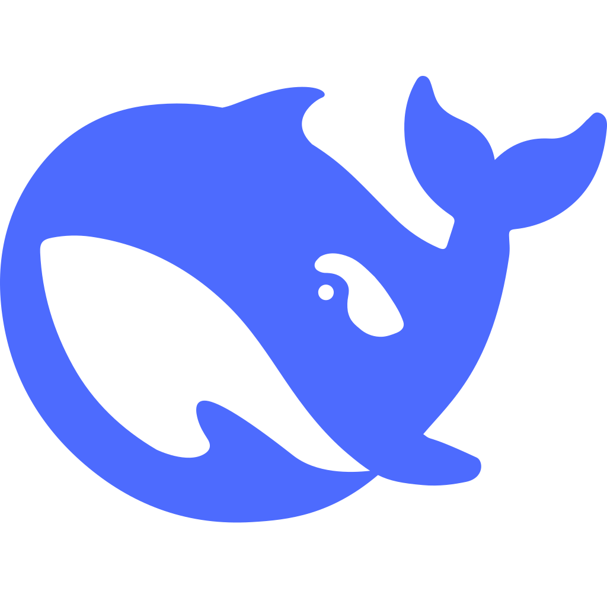

# Works with Ofox / Ofox 应用展示墙

基于 [Ofox](https://ofox.ai) 构建的应用和工具精选列表。Ofox 提供统一接口，一个 API Key 访问 Claude、GPT、Gemini、DeepSeek 等顶尖 AI 模型。

## 什么是 Ofox？

[Ofox](https://ofox.ai) 提供统一的 AI 模型接口，通过一个 API 访问多家供应商的模型。

**为什么选择 Ofox：**
- 一个接口访问多家 AI 模型
- 自动故障转移和负载均衡
- 无供应商锁定

## 获取 API Key

1. 在 [ofox.ai](https://ofox.ai) 注册账号
2. 充值并在控制台生成 API Key
3. 在下面任意应用中使用，或集成到你自己的项目

<!-- DO NOT EDIT THIS FILE DIRECTLY -->
<!-- 此文件由脚本自动生成，请参阅 CONTRIBUTING.md 了解如何添加你的应用 -->

## 目录

- [AIFlow](#aiflow)
- [CodeFlow](#codeflow)
- [DataWise](#datawise)
- [DeepChat](#deepchat)
- [DocuBot](#docubot)
- [PixelLab](#pixellab)
- [StudyMate AI](#studymate-ai)
- [WriteCraft](#writecraft)

## 应用列表

### [AIFlow](https://example.com/aiflow)

Visual workflow builder for AI automation. Drag-and-drop nodes to chain models, APIs, and data sources into production pipelines.

`productivity` `coding`

[Documentation](https://docs.example.com/aiflow/ofox)

---

### [CodeFlow](https://example.com/codeflow)

Smart code review and refactoring tool. Analyze pull requests, suggest improvements, and auto-fix common issues across your codebase.

`coding`

[Documentation](https://docs.example.com/codeflow/ofox)

---

### [DataWise](https://example.com/datawise)

Natural language data analysis. Upload CSV or connect databases, ask questions in plain language, get charts and insights instantly.

`data` `research` 

[Documentation](https://docs.example.com/datawise/ofox)

---

### [DeepChat](https://example.com/deepchat)

Multi-model chat interface with conversation branching, prompt templates, and team collaboration. Supports 20+ models through Ofox.

`chat` `productivity` 

[Documentation](https://docs.example.com/deepchat/ofox)

---

### [DocuBot](https://example.com/docubot)

Chat with your documents. Upload PDFs, Word files, or Notion pages and get accurate answers with source citations.

`chat` `research` 

[Documentation](https://docs.example.com/docubot/ofox)

---

### [PixelLab](https://example.com/pixellab)

AI-powered design tool for social media graphics, thumbnails, and banners. Generate and edit visuals with text prompts.

`media` `creative`

[Documentation](https://docs.example.com/pixellab/ofox)

---

### [StudyMate AI](https://example.com/studymate)

Adaptive learning companion that creates personalized study plans, generates practice questions, and explains concepts at your level.

`education` 

[Documentation](https://docs.example.com/studymate/ofox)

---

### [WriteCraft](https://example.com/writecraft)

AI writing assistant for blogs, emails, and marketing copy. Supports tone adjustment, multi-language translation, and SEO optimization.

`creative` `productivity`

[Documentation](https://docs.example.com/writecraft/ofox)

---

## 添加你的应用

想把你的应用添加到这个列表？参见 [CONTRIBUTING.md](CONTRIBUTING.md)。

---

Powered by [Ofox AI](https://ofox.ai) · 你的 AI 伙伴
